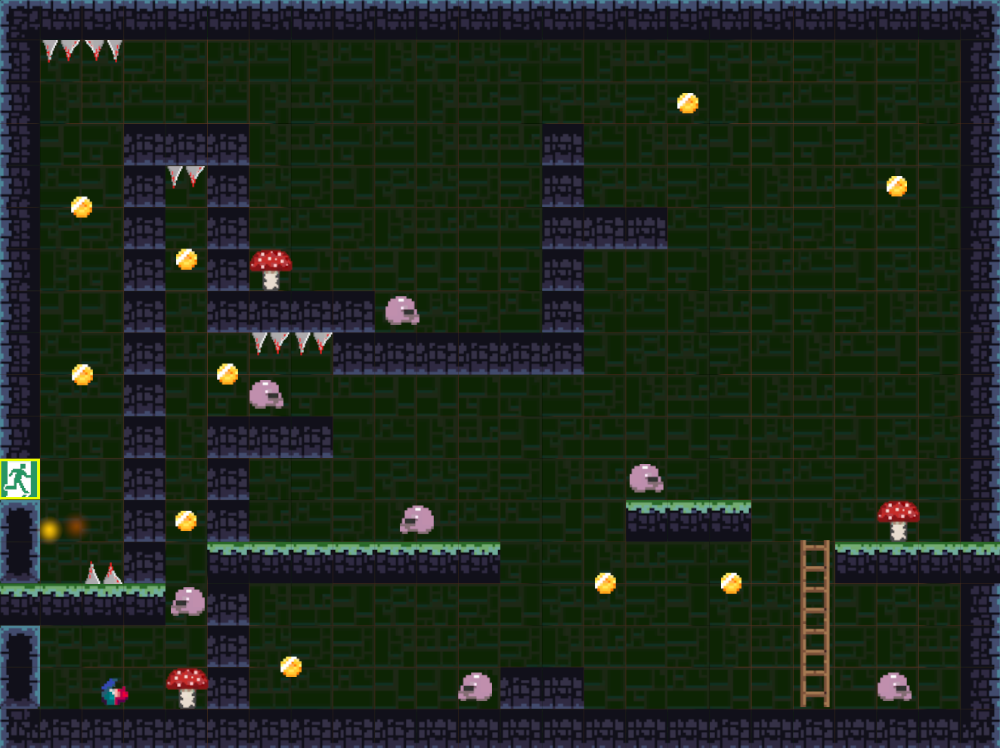
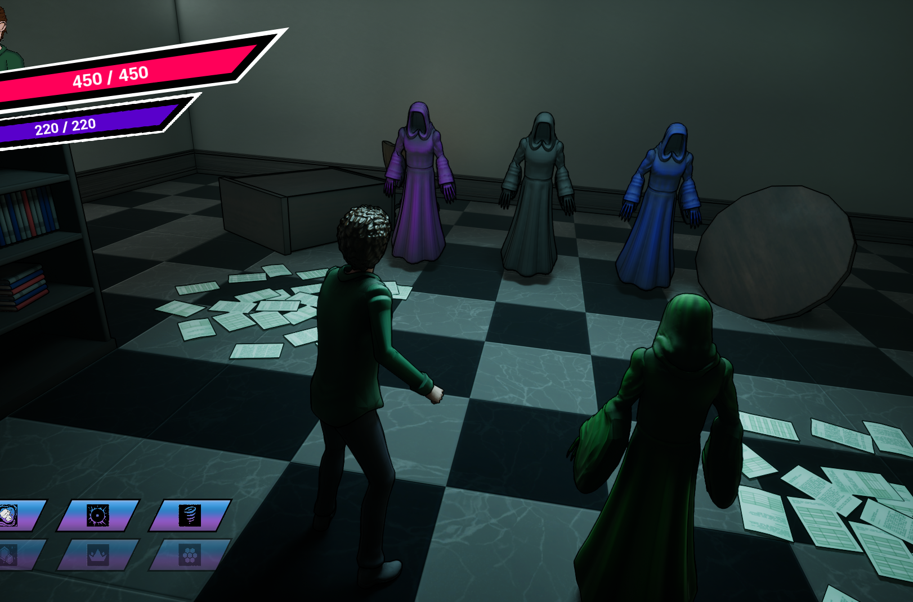
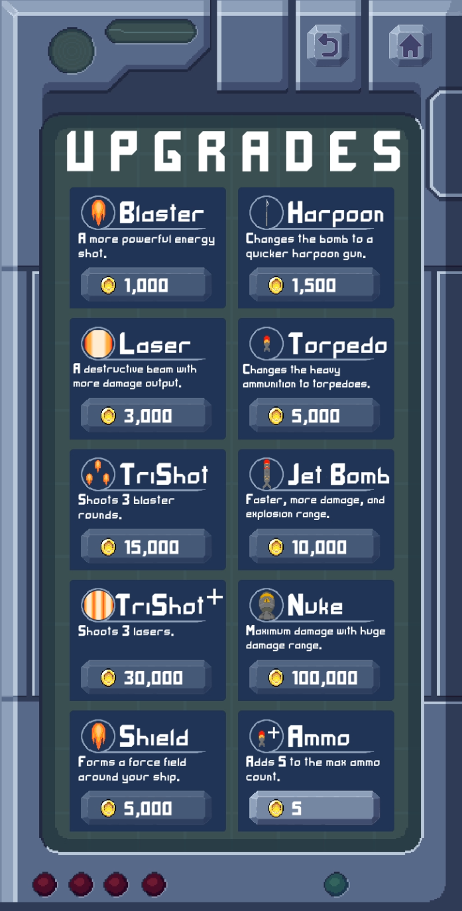
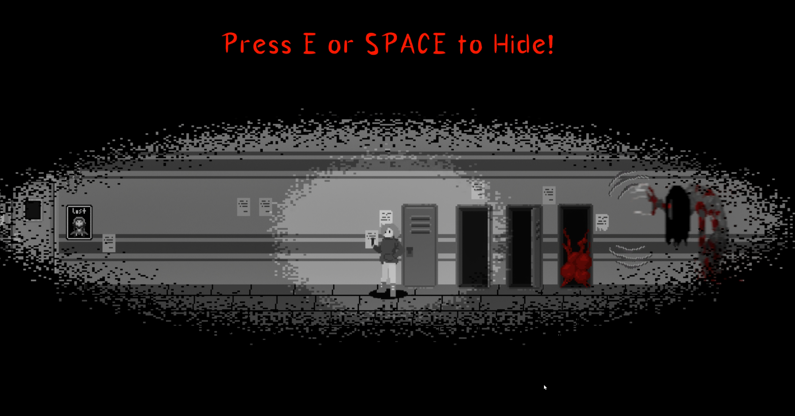

[Current Pursuits](activedev.md)

# Project Experiences

## Featured Projects

---

### Quantum Tether  
**Unity | C# | Itch.io**

A 2D roguelike sidescroller built around precision movement, grappling physics, and momentum-based traversal.

  

**Highlights**
- Designed a **vector-based grappling/tether system** for dynamic swinging between anchor points.  
- Built a **modular upgrade framework** (10+ abilities: dash cooldowns, dual threads, range modifiers, camera control).  
- Implemented **procedural anchor generation** using parametric and sinusoidal math to vary level rhythm.  
- Developed responsive **UI, HUD, menus**, scoring, collectibles, and difficulty scaling.  
- Added polish: pausing, camera upgrades, accessibility options.
- 
**Play:** [Quantum Tether on Itch.io](https://goldleafinteractive.itch.io/quantum-tether)  
**Video:** [YouTube Trailer](https://www.youtube.com/watch?v=RNs4yKPhfGM)

---

### Mysteries of Tupni  
**Unreal Engine 5 | Blueprints | Prototype**

A third-person fantasy adventure where I contributed to gameplay systems, inventory architecture, and interactive environments.

  

**Highlights**
- Created **interactive world elements** (doors, chests, teleporters, UI prompts).  
- Built a **Data Table–driven inventory system** with drag/drop, tooltips, filtering, and persistence across levels.  
- Integrated quests and NPC interactions to support player progression.  
- Contributed to level structure and preproduction design.

**View:** [MoT on Itch.io](https://goldleafinteractive.itch.io/mysteries-of-tupni)  
**Video:** [YouTube Video](https://www.youtube.com/watch?v=BQl2MkPxUl4)  

---

### Ginger Shroom Journey  
**Unity | C# | Steam**

A fully released 2D adventure game with responsibility for core gameplay systems, UI, and optimization.

  

**Highlights**
- Implemented **player movement, physics, enemies, and interactions**.  
- Built **UI, HUD, camera systems**, and environmental triggers.  
- Managed **Steamworks integration and publishing pipeline**.

**Steam:** [GSJ Steam Store Page (FREE!)](https://store.steampowered.com/app/2458650/Ginger_Shroom_Journey/)  
**Video:** [YouTube Video](https://www.youtube.com/watch?v=-LGDr3DaUB8)  

---

## Other Projects

---

### Void Knights  
**Unreal Engine 5 | Blueprints | Prototype**

A Persona-inspired RPG prototype centered on dual-world traversal and psychic mechanics.

  

**Highlights**
- Built a **world-shifting system** between Reality and the Void Verse for puzzles and progression.  
- Implemented **telekinetic object manipulation** using physics, line traces, and vector targeting.  
- Developed interactive exploration systems, NPC behaviors, and branching dialogue.

**View:** [Void Knights on Itch.io](https://goldleafinteractive.itch.io/void-knights) 

---

### Medieval Shop Game  
**C++ | Windows | Prototype**

A text-based shop simulation exploring low-level architecture and game systems in C++.

  

**Highlights**
- Implemented **inventory, negotiation, branching dialogue**, and state-driven interactions.  
- Built a custom **console UI with ASCII rendering and input handling**.  
- Integrated **DirectSound audio** for music and effects.  
- Architected with **RAII, smart pointers, modular state machines**.  
- Established full **CMake/Ninja → resource packing → installer → signed .exe** pipeline.

**View:** [Medieval Shop Game on Itch.io](https://goldleafinteractive.itch.io/medieval-shop-game)  

---

### Million Miles Deep  
**Unreal Engine 5 | Blueprints | Itch.io**

High-intensity 2D bullet hell set on an alien ocean world.

<!-- Portrait-friendly: two vertical images side-by-side -->

  
  

**Highlights**
- Designed **enemy AI patterns** and attack behaviors.  
- Implemented **projectile systems** and optimized collision handling.  
- Built menus, HUD, and responsive UI.

**Play:** [Million Miles Deep on Itch.io](https://goldleafinteractive.itch.io/million-miles-deep)  

---

### Ragdoll Plainly Perilous  
**Unreal Engine 5 | Blueprints | Itch.io**

An experimental physics-driven game exploring ragdoll-based movement.

  

**Highlights**
- Built **ragdoll-controlled player mechanics** using UE physics.  
- Designed **interactive, physics-driven environments**.  
- Optimized collision stability for consistent behavior.

**Play:** [Ragdoll: Plainly Perilous on Itch.io](https://goldleafinteractive.itch.io/ragdoll-plainly-perilous)  
**Video:** [YouTube Video](https://www.youtube.com/watch?v=GfrDt166KZI)  

---

### Crimson Eclipse  
**Unreal Engine 5 | Blueprints | Itch.io**

A 2D side-scroller horror project focused on tension, pacing, and survival-style encounters.

  

**Highlights**
- Implemented enemy behaviors and encounter logic to support horror pacing.  
- Built interactive environment systems and gameplay triggers.  
- Developed UI/HUD elements to communicate player state and progression.

**View:** [Crimson Eclilpse on Itch.io](https://goldleafinteractive.itch.io/crimson-eclipse)  
**Video:** [YouTube Video](https://www.youtube.com/watch?v=R7KG3vuqHx4)  

---

## Additional Projects

- **Doors n’ Dice (UE5)** – 2D platformer with chance-based door outcomes: death/respawn system, hazards/traps, enemy behaviors, and UI/menus.  
  - [Doors n' Dice on Itch.io](https://goldleafinteractive.itch.io/doors-n-dice)  
- **Escape Control (UE5)** – Top-down sci-fi shooter: UI widgets, menus, and core gameplay logic.  
- **Game Jams** – Rapid prototyping and mechanic-focused development.  
- **Backburner Prototypes** – Experimental systems, level design, and mechanics.

---

[Back to Home](index.md)

  
